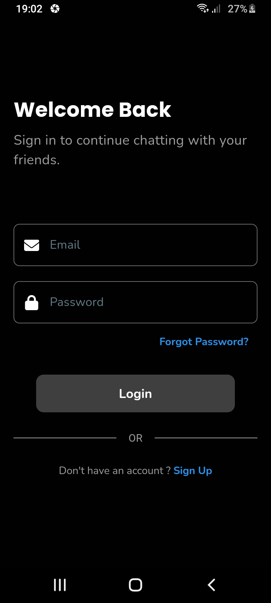
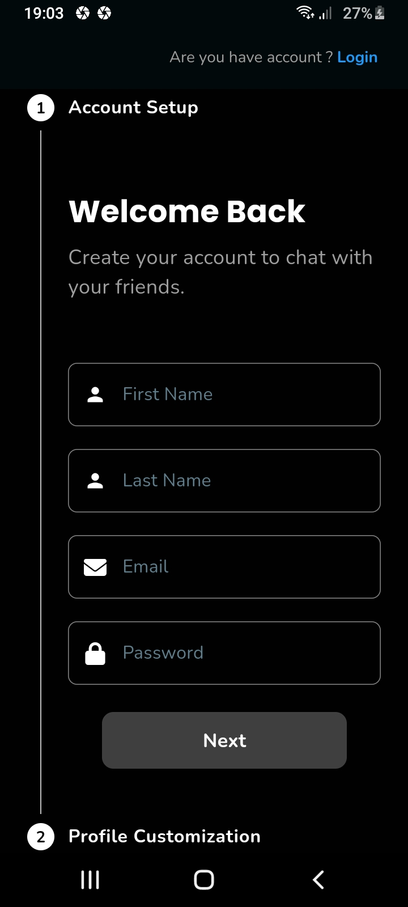
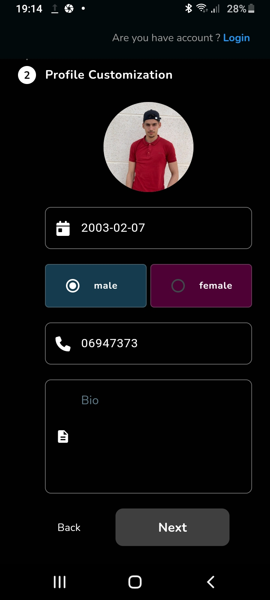
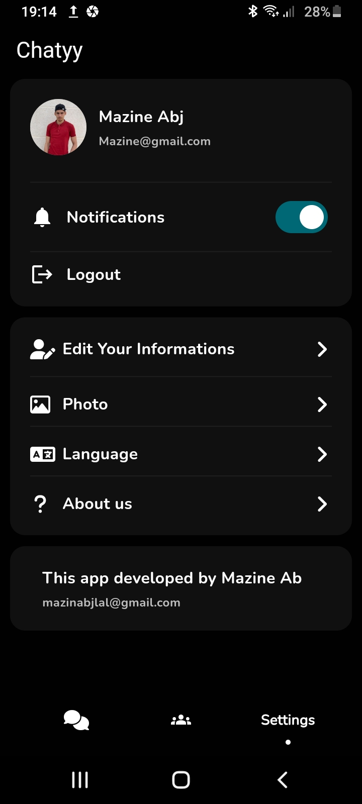
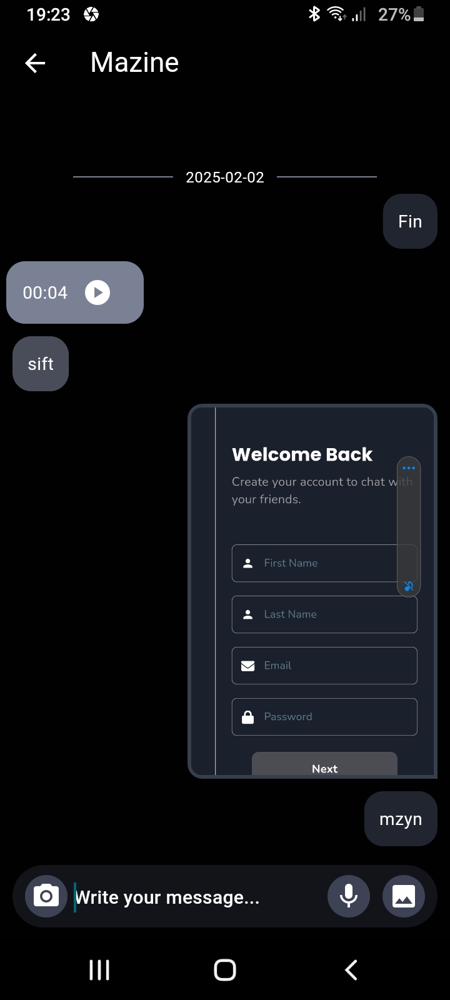

# 📝 Chat App

A modern chat application built with **Flutter**, **GetX** for state management, and **Firebase** for real-time communication. The app features a sleek UI with a **multi-step signup process, profile management, and real-time chat** with support for images, audio, and text messages.

---

## ✨ Features

- 🔹 **Multi-step signup** with a beautiful UI
- 🔹 **Modern dark mode design** for forms, profile, and chat screens
- 🔹 **Real-time messaging** with users and friends
- 🔹 **Send & receive images, audio messages, and text**
- 🔹 **Firebase integration** for seamless chat experience

---

## 🚀 Tech Stack

- **Flutter** (Cross-platform development)
- **GetX** (State management)
- **Firebase** (Real-time database & authentication)

---

## 📸 Screenshots
    

    

---

## 📥 Installation

1. **Clone the repository**
   ```sh
   git clone https://github.com/mazineab/flutter_chat_app.git
### 2️⃣ **Set up Firebase**
1. Go to the [Firebase Console](https://console.firebase.google.com/) and create a **new project**.
2. Enable **Firebase services**:
   - **Firebase Authentication**
   - **Cloud Firestore**
3. Download the `google-services.json` and place it in the `android/app` folder.

### 3️⃣ **Set up Environment Variables**
1. Rename the `.env.example` file to `.env`
2. Add your Firebase API keys, project ID, and other credentials.
